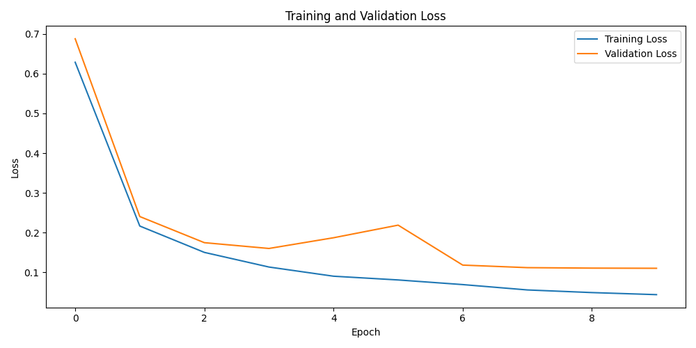
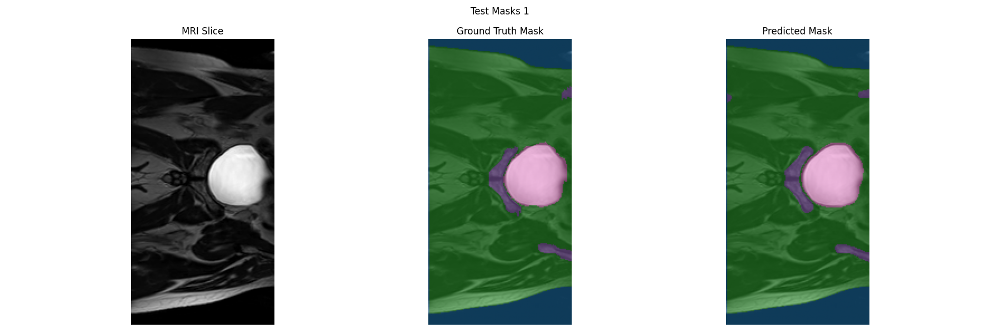

# Project Report - 48819099 - Francis Crouch
This project was created by Francis Crouch for the COMP3710 Project Report Assignment task in Semester 2 of 2025.

## The Algorithm
2D UNet for mask classification of HipMRI_Study_open dataset.

### What is the HipMRI Study Data?
The data being referred to is the provided HipMRI_Study_open dataset. This data is loaded from its own folder (HipMRI_Study_open) at the base location of the project. (HipMRI_Segmentation_48819099)

It contains some pre-processed data for training, validation, and test sets already split as provided in the project assignment. It additionally has the ground truth segmentation masks for all train, validation and test splits as well. This ensures the data can be used effectively for training, validation within training, and also ensuring the models performance on a number of unseen pieces of data.

- Train Images + Segmented Train Masks: 11460 .nii images each.
- Validation Images + Segmented Validation Masks: 660 .nii images each.
- Test Images + Segmented Test Masks: 540 .nii images each.
- All images and masks are provided at 256x128 resolution.

#### The masks are categorised with the following values(Found within the provided dataset reference):

0. Background
1. Body
2. Bones
3. Bladder
4. Rectum
5. Prostate

And are hard categorisations, rather than soft.

Pre-processing on the data has not particularly been performed, other than the code within dataset.py for effectively loading the medical image file format. Train, test, and validation dataset seperation has already been done to the dataset.

### What is the algorithm?
The algorithm is a 2D UNet that has been created to be trained on existing HipMRI study data, that has been pre-segmented by professionals and utilise this to learn the effective splitting method of each slice.

The 2D UNet utilises:
- A double convolutional layer structure at each decoder/encoder block, utilising the Relu Activation function.
    - 32 initial convolution filters.
- 4 Encoder blocks to downsample the given image file.
- 4 Decoder blocks to upsample the given image into the 
- Softmax activation to produce the final 6 category segmentation mask.

The algorithm produces the masks similar to the masks that were originally provided, but on new, un-seen data. This means that the model is capable of labelling where on a new HipMRI each part of the body is located just by the look of it, and can even tell if a specific category is not viewable in a specific slice. In real-world application, this could immensely free up the time and effort of medical professionals reading and understanding Hip MRI images, slices and inconsistencies. 

This same approach which has been used on this data could also possibly be used in the training of a slightly more complex model (but similar) on a dataset that involves the detection and categorisation of cancers within these areas. The training of this model would also not be completely limited to just HipMRIs. If there was data available for MRIs of other body parts, it could be trained against those with new category definitions and with little human effort to adapt the model, could produce similar results.

### Model Training
The model trains using the specific segmented train data, and additionally calculates validation loss at the end of every epoch using the validation data. The model utilises ModelCheckpointing, Learning Rate Reduce on Plateau and Early Stopping to effectively manage the training beyond hyperparamater tuning and model structure. 
- Model Checkpointing allows the saving of the models values at each Epoch, ensuring that the loss decreases between. If this does not occur, it will not overwrite the current saved model. This also allows for manual early stopping for testing purposes as at every epoch it is saving the values of the model.
- Learning Rate Reduce on Plateau, allows for a variable learning rate that changes with the performance of the model. If the loss in the model starts to plateau and not change, the learning rate will be lowered to compensate.
- Early Stopping will end the training on the model once loss values stop changing/decreasing for too many epochs. This likely means the model has found a minima (local or global) and the model will not train any further when trained for further epochs.

The model has been trained with the following hyperparameters:
- Learning rate using Adam Optimizer of: 1e-4
- Loss = 'categorical-crossentropy'
- Img Size = 256, 128
- Batch Size = 64 (a good mix pick between taking too long to train, and exceeding memory availability, as well as training generalisation)

## How to use
### Dependencies: 
- Python (3.13.7)
- tensorflow (2.20.0)
- numpy (2.2.6)
- scikit-image (0.25.2)
- tqdm (4.67.1)
- nibabel (5.3.2)
- matplotlib (3.10.6)

### Train model
- Run Train.py
    - Important hyperparameters (epochs, batch size, image size, num classes) and data file locations can be changed at the top of the file.
    - The best model parameters will save to the MODEL_SAVE_OUT location.

### Test (Predict) using model
- Run predict.py
    - Set the image shape and number of classes to how they were when the model was trained.
    - Ensure TRAINED_MODEL is pointing to the best model parameters .h5 file.
    - Results will print to terminal/be visualised using matplotlib.

## Training Results

### Loss Graphed over Training Epochs (Categorical Cross-Entropy)

## Test Results

### Example Input/Ground Truth Mask/Predicted Mask

### DICE Scores over Mean + Classes

| Metric | Value |
|---|---|
| Mean Dice across all Classes | 0.9152 |
| Class 0 Dice Score | 0.9965 |
| Class 1 Dice Score | 0.9822 |
| Class 2 Dice Score | 0.9267 |
| Class 3 Dice Score | 0.9603 |
| Class 4 Dice Score | 0.7855 |
| Class 5 Dice Score | 0.8399 |